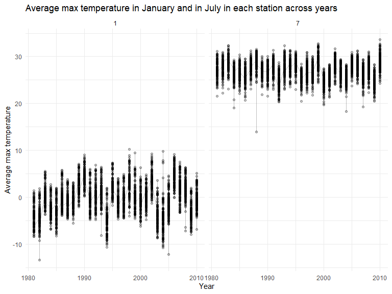

p8105_hw3_wm2460
================
Wenyan Ma
2022-10-07

## Problem 1

## Problem 2

### Step 1: Tidy the dataset

``` r
accel_df = read_csv("./accel_data.csv") %>% 
  janitor::clean_names() %>% 
  pivot_longer(
    activity_1:activity_1440, 
    names_prefix = "activity_", 
    names_to = "minute", 
    values_to = "activity") %>% 
  mutate(minute = as.numeric(minute), 
         day_of_week = recode(day,"Monday" = "Weekday", 
                                   "Tuesday" = "Weekday", 
                                   "Wednesday" = "Weekday", 
                                   "Thursday" = "Weekday", 
                                   "Friday" = "Weekday", 
                                   "Saturday" = "Weekend", 
                                   "Sunday" = "Weekend"))
```

    ## Rows: 35 Columns: 1443
    ## ── Column specification ────────────────────────────────────────────────────────
    ## Delimiter: ","
    ## chr    (1): day
    ## dbl (1442): week, day_id, activity.1, activity.2, activity.3, activity.4, ac...
    ## 
    ## ℹ Use `spec()` to retrieve the full column specification for this data.
    ## ℹ Specify the column types or set `show_col_types = FALSE` to quiet this message.

#### Describe the dataset

In the `accel_df` dataset, there are 50400 observations and 6 variables.
The variables in this dataset include week, day_id, day, minute,
activity, day_of_week.

### Step 2: Traditional analyses of accelerometer data

``` r
traditional = accel_df %>%
  group_by(week, day) %>%
  summarize(activity_sum = sum(activity)) %>% 
  knitr::kable(
    caption = "Total activity for each day")
```

    ## `summarise()` has grouped output by 'week'. You can override using the
    ## `.groups` argument.

#### Trend

The trend is apparent. The total activity across Monday to Friday is
more than the total activity done during the weeekend.

### Step 3: Single-panel plot

``` r
accel_df %>% 
  ggplot(aes(x = minute/60, y = activity, color = day)) + 
  geom_line(alpha = .5) +
  labs(title = "24-hour activity time courses for each day",
       x = "Hour",
       y = "Activity measured by accelerometer") +
  theme_bw()
```

<!-- -->

#### Patterns

From the plot above, we can see that from hour 0 to hour 5, there were
usually not a lot of activity detected by the accelerometer. Between
hour 6 and hour 19, there are some more activity than the earlier hours.
However, most intense activity patterns usually happen between hour 19
and hour 22. This pattern is quite consistent across all 7 days of the
week.

## Problem 3

``` r
data("ny_noaa")
```

### Exploration of this dataset

In the original `ny_noaa` dataset, there are 2595176 observations and 7
variables. The variables in this dataset include id, date, prcp, snow,
snwd, tmax, tmin.

There are a lot of observations with missing values in this dataset. For
the variable `prcp`, there are 145838 missing values. For the variable
`snow`, there are 381221 missing values. For the variable `snwd`, there
are 591786 missing values. For the variable `tmax`, there are 1134358
missing values. For the variable `tmin`, there are 1134420 missing
values.

### Step 1: Data cleaning

``` r
noaa_new = ny_noaa %>% 
  janitor::clean_names() %>%
  separate(date, into = c("year", "month", "day"), convert = TRUE) %>% 
  filter(prcp >= "0", snow >= "0", snwd >= "0")

names(sort(-table(noaa_new$snow)))[1]
```

    ## [1] "0"
